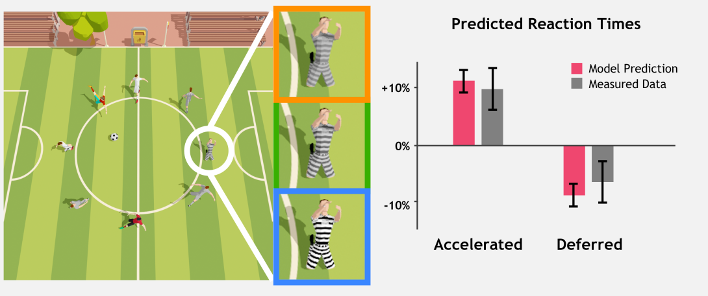

# Image Features Influence Reaction Time:<br/>A Learned Probabilistic Perceptual Model for Saccade Latency

[\[project page\]](https://budmonde.com/projects/gaze-timing) [\[arXiv\]](https://arxiv.org/abs/2205.02437)



We aim to ask and answer an essential question "how quickly do we react after observing a displayed visual target?" To this end, we present psychophysical studies that characterize the remarkable disconnect between human saccadic behaviors and spatial visual acuity. Building on the results of our studies, we develop a perceptual model to predict temporal gaze behavior, particularly saccadic latency, as a function of the statistics of a displayed image. Specifically, we implement a neurologically-inspired probabilistic model that mimics the accumulation of confidence that leads to a perceptual decision. We validate our model with a series of objective measurements and user studies using an eye-tracked VR display. The results demonstrate that our model prediction is in statistical alignment with real-world human behavior. Further, we establish that many sub-threshold image modifications commonly introduced in graphics pipelines may significantly alter human reaction timing, even if the differences are visually undetectable. Finally, we show that our model can serve as a metric to predict and alter reaction latency of users in interactive computer graphics applications, thus may improve gaze-contingent rendering, design of virtual experiences, and player performance in e-sports. We illustrate this with two examples: estimating competition fairness in a video game with two different team colors, and tuning display viewing distance to minimize player reaction time.

## Usage

Our trained model can be easily invoked to query reaction time predictions given the contrast, frequency, and eccentricity values of a stimulus.
For further details about the model, please refer to [our paper](https://arxiv.org/abs/2205.02437).

As a prerequisite, you need to install `numpy`, and `pytorch`. The script also imports `matplotlib` to visualize the output, but is optional.

```shell
pip install -r requirements.txt
```

The model can be run from the command line as

```shell
python model.py <CONTRAST> <FREQUENCY> <ECCENTRICITY>
```

For more options, run

```shell
python model.py -h
```

## Citation

Budmonde Duinkharjav, Praneeth Chakravarthula, Rachel Brown, Anjul Patney, Qi Sun<br/>
Image Features Influence Reaction Time: A Learned Probabilistic Perceptual Model for Saccade Latency.<br/>
ACM Transactions on Graphics 41(4) (Proceedings of ACM SIGGRAPH 2022)

```bibtex
@article{Duinkharjav:2022:GazeTiming,
    title = {Image Features Influence Reaction Time: A Learned Probabilistic Perceptual Model for Saccade Latency},
    author = {Duinkharjav, Budmonde and Chakravarthula, Praneeth and Brown, Rachel and Patney, Anjul and Sun, Qi},
    journal = {ACM Trans. Graph. (Proc. SIGGRAPH)},
    volume = {41},
    number = {4},
    pages = {144:1--144:15},
    year = {2022}
}
```

[BibTeX](docs/gaze-timing.bib)

## Coverage

- [SIGGRAPH 2022 Best Paper Award Blog Post](https://blog.siggraph.org/2022/07/siggraph-2022-technical-papers-awards-best-papers-and-honorable-mentions.html/)
- [NVIDIA Project Page](https://research.nvidia.com/publication/2022-08_image-features-influence-reaction-time-learned-probabilistic-perceptual-model)
- [NYU Project page](https://www.immersivecomputinglab.org/publication/image-features-influence-reaction-time-a-learned-probabilistic-perceptual-model-for-saccade-latency/)
